<div align="center">



<h3>I build the software behind your next big move.</h3>

<p>Multi-tenant SaaS &nbsp;·&nbsp; ERP / CRM platforms &nbsp;·&nbsp; AI products &nbsp;·&nbsp; IoT systems</p>

<a href="https://wazir.dabluete.pk/"></a>
<a href="http://dabluete.com/"></a>
<a href="mailto:wazirtufail67@hotmail.com"></a>

<br>

<table width="100%">
  <tr>
    <td align="center" width="33%"><b>7+ years</b><br>building production software</td>
    <td align="center" width="33%"><b>12 products</b><br>shipped at Dabluete</td>
    <td align="center" width="33%"><b>Web · Mobile · IoT · AI</b><br>platforms delivered</td>
  </tr>
</table>

</div>

<h2 align="center">~/about</h2>

```js
const developer = {
  name: "Muhammad Tufail",
  roles: ["Senior Software Engineer", "Solutions Architect", "Project Lead"],
  experience: "7+ years",
  currently: ["Project Leader @ Dabluete", "Team Leader @ Saviors"],
  education: "MSCS, Muhammad Ali Jinnah University",
  location: "Karachi, Pakistan",
  builds: ["Multi-tenant SaaS", "ERP / CRM", "AI products", "IoT systems"],
  mainStack: ["Laravel", "React", "TypeScript", "Flutter", "Python"],
  mission: "Build the software behind your next big move.",
};
```

<h2 align="center">~/stack</h2>

<div align="center">

<b>Languages</b><br>
  
  
  
  
  
<br><br>
<b>Backend</b><br>
  
  
  
  
<br><br>
<b>Frontend &amp; Mobile</b><br>
  
  
  
  
  
  
<br><br>
<b>Data &amp; Servers</b><br>
  
  
  
  
  
<br><br>
<b>IoT &amp; Industrial</b><br>
  
  
  
  
  
<br><br>
<b>AI &amp; Integrations</b><br>
  
  
  
  
  
  
  
  
<br><br>

</div>

<h2 align="center">~/products</h2>

<p align="center">Built at <a href="http://dabluete.com/">Dabluete</a>. Click a product name to see it live.</p>

<table width="100%">
  <tr>
    <td valign="top" width="50%">
      <a href="https://dabluete.com/dablue-erp"><b>Dablue ERP</b></a><br>
      Modular ERP: accounting, HR / payroll, CRM, POS, inventory, projects<br>
      <sub><code>Laravel · React · TypeScript</code></sub>
    </td>
    <td valign="top" width="50%">
      <a href="https://dabluete.com/dablue-crm"><b>Dablue CRM</b></a><br>
      Leads, invoices, contracts and support with an AI chatbot and built-in calls<br>
      <sub><code>CodeIgniter · JavaScript</code></sub>
    </td>
  </tr>
  <tr>
    <td valign="top" width="50%">
      <a href="https://dabluete.com/products/campuscore-school-management-system"><b>CampusCore</b></a><br>
      Multi-tenant school ERP with web, Android and iOS apps<br>
      <sub><code>PHP · Flutter</code></sub>
    </td>
    <td valign="top" width="50%">
      <b>OmniMedix</b><br>
      Hospital management: OPD / IPD, pharmacy, lab, billing, blood bank<br>
      <sub><code>Laravel · React · TypeScript</code></sub>
    </td>
  </tr>
  <tr>
    <td valign="top" width="50%">
      <a href="https://dabluete.com/nazim-hotel-pms"><b>Nazim Hotel PMS</b></a><br>
      Booking engine, restaurant POS, housekeeping and accounting<br>
      <sub><code>CodeIgniter · JavaScript</code></sub>
    </td>
    <td valign="top" width="50%">
      <a href="https://dabluete.com/dialpulseai"><b>DialPulse.AI</b></a><br>
      AI voice calling, auto-dialer, IVR, SMS and call transcription<br>
      <sub><code>Laravel · React · TypeScript</code></sub>
    </td>
  </tr>
  <tr>
    <td valign="top" width="50%">
      <b>ZetaChat</b><br>
      AI sales assistant widget that answers from your own content<br>
      <sub><code>Laravel · React · Flutter</code></sub>
    </td>
    <td valign="top" width="50%">
      <a href="https://dabluete.com/helpbuddy"><b>HelpBuddy</b></a><br>
      AI helpdesk: ticket classification, sentiment analysis, live chat<br>
      <sub><code>Laravel · React · Flutter</code></sub>
    </td>
  </tr>
</table>

<p align="center"><sub>Also shipped: CapMatrix (ride-hailing), FixAll (home services marketplace), StockerPRO (inventory) and Resto (restaurant POS).</sub></p>

<h2 align="center">~/career</h2>

```text
career/
├── 2021 → now   Project Leader     @ Dabluete                   # high-end SaaS products
├── 2024 → now   Team Leader        @ Saviors                    # overseas client solutions
├── 2019 → 2024  Software Engineer  @ ABCtechnologies            # IoT and thermodynamics
└── 2018 → 2021  MSCS               @ Muhammad Ali Jinnah Univ.  # Computer Science
```

<h2 align="center">~/contact</h2>

<div align="center">


<br>

<a href="https://wazir.dabluete.pk/"></a>
<a href="mailto:wazirtufail67@hotmail.com"></a>

</div>
